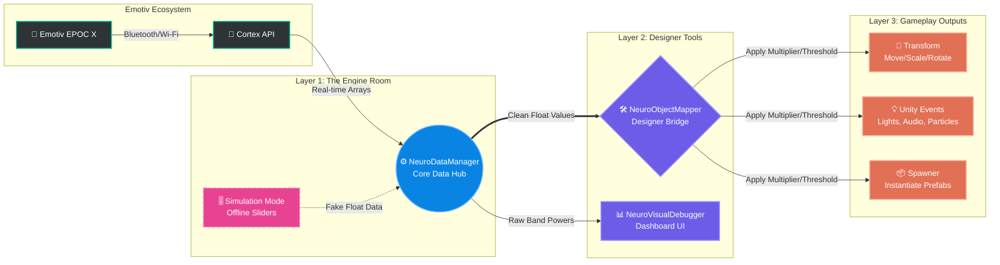

#  NeuroDesign Toolkit for Unity

**A 100% No-Code, Game-Feel focused framework for Brain-Computer Interface (BCI) Game Design.**

 **Exclusive Content:** *This toolkit and its documentation are created exclusively for the **MA Game Design** students at **Ulster University**.*

This toolkit bridges the gap between the Emotiv EPOC X headset and Unity. It is designed to help Game Designers and Technical Artists prototype mind-controlled mechanics, test systemic interactions, and iterate rapidly without writing code.

---

##  Core Capabilities
* **Systemic Integration:** Map raw brainwave data or mental commands to any GameObject via a context-sensitive Inspector UI.
* **Game-Feel Calibration:** Granular control over mechanic responsiveness using built-in `Multiplier`, `Threshold`, and `Smooth Speed` (Lerp) algorithms.
* **Offline Prototyping:** A robust "Simulation Mode" allowing level design and logic testing without physical headset hardware.
* **Event-Driven Architecture:** Connect cognitive states to Unity Events, enabling complex interactions like dynamic audio mixing, procedural animation, or shader adjustments.

---

##  Installation Guide

1. Download the `NeuroDesignToolkit_v1.0.unitypackage` from the **[Releases](../../releases)** tab. *(Alternatively, find it in the repository files).*
2. Open your Unity Project (3D/URP/Standard supported).
3. Drag the `.unitypackage` into your `Project` window (or `Assets > Import Package > Custom Package`).
4. Click **Import All**.

---

## Quick Start: Basic Setup

### Step 1: Initialize the Engine
1. Navigate to your `Assets/Prefabs` folder.
2. Drag the **`NeuroManager`** prefab into your scene hierarchy.
3. In the Inspector, enter your trained Emotiv **Profile Name**. 
*(For offline development, simply enable **Simulation Mode**).*

### Step 2: Map Your First Interaction
1. Create a 3D object (e.g., a Cube).
2. Attach the **`Neuro Object Mapper`** component.
3. Assign the `NeuroManager` from your hierarchy to the **Data Manager** field.
4. Select an Input Signal (e.g., `Mental Commands` -> `Push`).
5. Configure Transform Mapping (e.g., `Mode = Position`, enable the `Y` axis).
6. Press **Play** and focus on the mapped command.

---

##  Architecture & Modularity

The framework utilizes a decoupled, 3-layer architecture, allowing advanced students to extend its functionality safely.

### 1. The Core Data Hub (`NeuroDataManager.cs`)
The central data broker. It handles the API handshake, mitigates SDK instabilities, and provides a clean data stream.
* **Offline Simulation Mode:** Disconnects the API and exposes UI sliders to mock over 20 distinct cognitive and facial inputs.

  

**Design Potential:** Simulation mode is essential for iterative design. It allows you to test edge cases, systemic loops (e.g., how the game reacts if a player's stress spikes simultaneously with a mental command), and script logic without the constraints of continuous headset usage.

---

### 2. The Bridge (`NeuroObjectMapper.cs`)
The primary designer tool. It translates raw float data from the Hub into actionable game states via a context-aware UI.

  
   

**Design Potential (Beyond Linear Interaction):** While direct 1:1 mapping (e.g., "Think Push to move a block") is foundational, the tool supports emergent mechanics. By utilizing the `Unity Event` hook and combining multiple mappers, you can design systemic behaviors:
* **Dynamic Difficulty:** Use the `Stress` metric to alter enemy spawn rates or AI aggression via a custom script.
* **Environmental Storytelling:** Map `Alpha` waves (relaxation) to post-processing profiles, changing the visual tone of the room as the player calms down.
* **Multi-modal Inputs:** Require simultaneous physical input (controller) and cognitive state (e.g., high Focus) to unlock specific abilities.

---

### 3. The Visualizer (`NeuroVisualDebugger.cs`)
A real-time diagnostic dashboard translating raw frequency bands into readable UI states.

  

**Design Potential:** BCI inputs are inherently noisy and subjective. This tool acts as your live calibration matrix. During playtesting, observe how different events impact the player's cognitive baseline, and use that empirical data to define accurate `Threshold` and `Multiplier` values in your mechanics.

---
*Created for the MA Game Design Program at Ulster University.*

