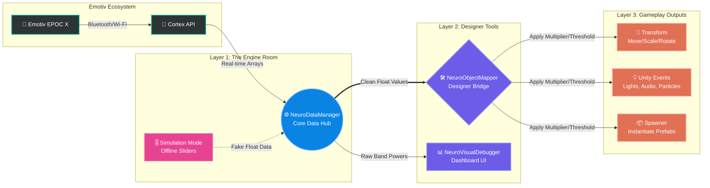

# 🧠 NeuroDesign Toolkit for Unity

**A 100% No-Code, Game-Feel focused framework for Brain-Computer Interface (BCI) Game Design.**

Welcome! This toolkit is designed specifically for Game Designers and Technical Artists. It bridges the gap between the Emotiv EPOC X headset and Unity, allowing you to prototype mind-controlled game mechanics instantly without writing a single line of code.

▶️ **[Watch the 3-Minute Video Tutorial Here](INSERT_YOUTUBE_LINK_HERE)** *(Note: Replace this with your actual video link)*

---

## ✨ Key Features
* **🚫 Zero Coding Required:** Connect brainwaves to any GameObject using a clean, context-sensitive Inspector UI.
* **🎮 Game-Feel Oriented:** Built-in sliders for `Multiplier`, `Threshold`, and `Smooth Speed` so you can tune the exact responsiveness of your mechanics.
* **🏠 Offline Simulation Mode:** Don't have the headset at home? No problem! Toggle "Simulation Mode" to fake brain data using UI sliders and keep designing your levels.
* **📦 Event-Driven Architecture:** Easily trigger animations, audio, lighting, or particle systems using standard Unity Events.

---

## 🚀 Installation Guide

1. Download the latest `NeuroDesignToolkit_v1.0.unitypackage` from the **[Releases](../../releases)** tab on the right.
2. Open your Unity Project (Make sure it's 3D/URP/Standard).
3. Drag and drop the `.unitypackage` file into your `Project` window, or go to `Assets > Import Package > Custom Package...`.
4. Click **Import All**.

---

## 🕹️ Quick Start: How to Use

### Step 1: Start the Engine
1. Go to your `Assets/Prefabs` folder.
2. Drag the **`NeuroManager`** prefab into your scene.
3. Select it, and in the Inspector, type your Emotiv **Profile Name** (the one you trained). 
*(Note: If you are at home without a headset, simply check the **Simulation Mode** box here!)*

### Step 2: Animate an Object with your Mind
1. Create a simple 3D object in your scene (e.g., a Cube).
2. Add the **`Neuro Object Mapper`** component to it.
3. Drag the `NeuroManager` from your Hierarchy into the **Data Manager** slot.
4. Choose your Input Signal (e.g., `Mental Commands` -> `Push`).
5. Choose your Transform Mapping (e.g., `Mode = Position`, check `Y` axis).
6. Press **Play** and focus on pushing!

---

## 🛠️ Core Components Glossary

* **`NeuroManager` (The Engine):** The invisible brain of the system. It automatically handles background authentication, hardware connection, and data extraction. 
* **`NeuroObjectMapper` (The Tool):** Your primary design tool. Attach this to anything you want to move, scale, rotate, or trigger. 
* **`NeuroVisualDebugger` (The X-Ray):** A UI dashboard that shows you the raw frequencies of the player's brain in real-time. Use this to balance your game's difficulty!

---

## 🏗️ Under the Hood: System Architecture & Modularity

For students and developers interested in extending this toolkit for their own advanced mechanics, the framework is built on a strict, 3-layer modular architecture. You don't need to touch the core to build upon it!

### 1. The Core Data Hub (`NeuroDataManager.cs`)
The central nervous system. It handles the constant stream of data seamlessly:
* 🌐 **Real-Time Mode:** Automatically handshakes with the Emotiv Cortex API, bypasses known SDK bugs, and extracts pure array data directly from the headset.
* 🏠 **Offline Simulation Mode:** Disconnects from the Emotiv API and feeds the game with dummy values from UI sliders. Perfect for working on assignments on your laptop!

*(SCREENSHOT 1 : Show the NeuroManager Inspector with Simulation Mode enabled)*

  

### 2. The Bridge (`NeuroObjectMapper.cs`)
A highly modular translation layer. Instead of writing custom scripts, this grabs raw float data from the Hub and converts it into actionable gameplay using a Custom Editor (`NeuroObjectMapperEditor.cs`) to keep the UI clean. 

*(SCREENSHOT 2 : Show the NeuroObjectMapper Inspector on a Cube/Light)*

### 3. The Visualizer (`NeuroVisualDebugger.cs`)
A lightweight diagnostic tool that reads raw band powers (Alpha, Beta, etc.) and translates them into smooth UI sliders. Use this "X-Ray" to balance your game's difficulty and find the perfect Threshold numbers!

*(SCREENSHOT 3 : Show the Game View with the 4 UI Sliders visible)*

---
*Created for the Game Design Master's Program.*
